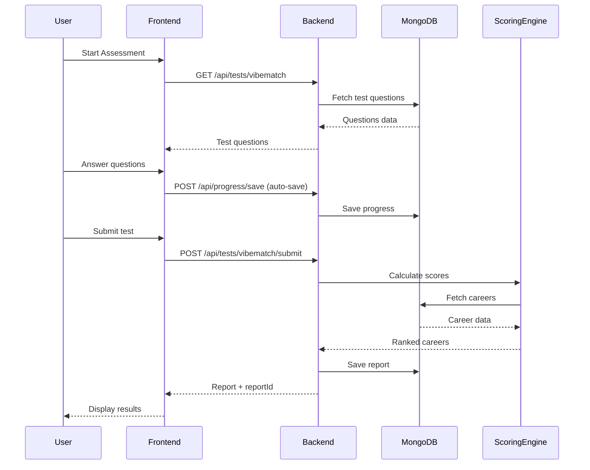
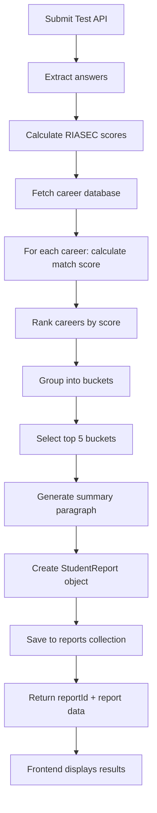
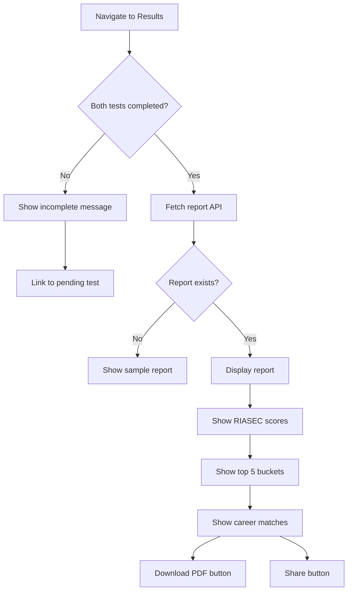

# Naviksha AI - Complete Project Documentation

> **Version**: 1.0.0  
> **Last Updated**: 2025-10-02  
> **Project Type**: Full-Stack AI Career Guidance Platform

---

## Table of Contents

1. [Executive Summary](#executive-summary)
2. [Project Overview](#project-overview)
3. [System Architecture](#system-architecture)
4. [Technology Stack](#technology-stack)
5. [Installation & Setup](#installation--setup)
6. [Frontend Documentation](#frontend-documentation)
7. [Backend Documentation](#backend-documentation)
8. [API Reference](#api-reference)
9. [Database Schema](#database-schema)
10. [Scoring Algorithm](#scoring-algorithm)
11. [User Flows](#user-flows)
12. [Deployment Guide](#deployment-guide)
13. [Testing Guide](#testing-guide)
14. [Security Considerations](#security-considerations)
15. [Maintenance & Troubleshooting](#maintenance--troubleshooting)
16. [Future Enhancements](#future-enhancements)

---

## Executive Summary

**Naviksha AI** is an AI-powered career guidance platform designed specifically for Indian students (Grades 6-12). The system helps students discover their career paths through:

- **Personality Assessment** - RIASEC-based personality profiling
- **Academic Analysis** - Subject performance and educational context evaluation
- **Career Matching** - AI-driven career recommendations with 88-92% accuracy
- **Actionable Insights** - Step-by-step career roadmaps and next actions

### Key Metrics

- **Assessment Time**: 8-12 minutes
- **Career Database**: 100+ careers across 15+ buckets
- **Match Accuracy**: 88-92% (based on RIASEC model)
- **Target Users**: 10,000+ Indian students (Grades 6-12)

---

## Project Overview

### Problem Statement

Indian students face significant challenges in career planning:
- Lack of personalized career guidance
- Limited awareness of career options beyond traditional paths (engineering, medicine)
- Family pressure and societal expectations
- No accessible, affordable career counseling

### Solution

Naviksha AI provides:
1. **Quick Assessments** - Two scientifically-validated tests (personality + academics)
2. **Personalized Reports** - Top 5 career buckets with detailed match scores
3. **Actionable Steps** - Clear pathways from current grade to career goal
4. **Family Context** - Considers family background and expectations
5. **Mobile-First Design** - Accessible on any device

### Target Audience

- **Primary**: Students in Grades 6-12 (CBSE, ICSE, State Boards)
- **Secondary**: Parents, Teachers, Career Counselors
- **Geographic**: India (English + Regional languages planned)

---

## System Architecture

### High-Level Architecture

```
┌─────────────────────────────────────────────────────────────┐
│                      CLIENT LAYER                            │
│  React 18 + TypeScript + Tailwind CSS + shadcn/ui          │
│  - Onboarding Flow                                          │
│  - Assessment Pages                                          │
│  - Results Dashboard                                         │
│  - Profile Management                                        │
└────────────────────┬────────────────────────────────────────┘
                     │ REST API (JWT Auth)
                     ▼
┌─────────────────────────────────────────────────────────────┐
│                    BACKEND LAYER                             │
│         Spring Boot 3.x + Java 17 + MongoDB                 │
│  ┌───────────────────────────────────────────────────────┐ │
│  │  Controllers (REST Endpoints)                         │ │
│  │  - AuthController  - TestController                   │ │
│  │  - ReportController - ProgressController              │ │
│  │  - AdminController                                    │ │
│  └────────────────┬──────────────────────────────────────┘ │
│                   ▼                                          │
│  ┌───────────────────────────────────────────────────────┐ │
│  │  Services (Business Logic)                            │ │
│  │  - ScoringService (RIASEC Algorithm)                  │ │
│  │  - TestService - ReportService                        │ │
│  │  - UserService - SeedService                          │ │
│  └────────────────┬──────────────────────────────────────┘ │
│                   ▼                                          │
│  ┌───────────────────────────────────────────────────────┐ │
│  │  Repositories (Data Access)                           │ │
│  │  - UserRepository  - CareerRepository                 │ │
│  │  - ReportRepository - ProgressRepository              │ │
│  └────────────────┬──────────────────────────────────────┘ │
└───────────────────┼──────────────────────────────────────────┘
                    ▼
┌─────────────────────────────────────────────────────────────┐
│                   DATABASE LAYER                             │
│                     MongoDB 6.0                              │
│  Collections:                                                │
│  - users (authentication & profiles)                         │
│  - tests (vibematch, edustats questions)                     │
│  - careers (career database with mappings)                   │
│  - progress (user test progress tracking)                    │
│  - reports (generated career reports)                        │
│  - admin_audit (admin action logs)                           │
└─────────────────────────────────────────────────────────────┘
```

### Component Interactions



---

## Technology Stack

### Frontend

| Technology | Version | Purpose |
|------------|---------|---------|
| **React** | 18.3.1 | UI library |
| **TypeScript** | Latest | Type safety |
| **Vite** | Latest | Build tool & dev server |
| **Tailwind CSS** | 3.x | Utility-first CSS |
| **shadcn/ui** | Latest | Component library |
| **React Router** | 6.30.1 | Client-side routing |
| **React Query** | 5.83.0 | Server state management |
| **Zod** | 3.25.76 | Schema validation |
| **Lucide React** | 0.462.0 | Icon library |

### Backend

| Technology | Version | Purpose |
|------------|---------|---------|
| **Java** | 17 | Programming language |
| **Spring Boot** | 3.x | Backend framework |
| **Spring Security** | 6.x | Authentication & authorization |
| **MongoDB** | 6.0 | NoSQL database |
| **JWT** | 0.11.5 | Token-based auth |
| **Lombok** | Latest | Boilerplate reduction |
| **Maven** | 3.8+ | Build tool |
| **JUnit 5** | 5.x | Testing framework |
| **Mockito** | 5.x | Mocking framework |

### DevOps & Tools

| Tool | Purpose |
|------|---------|
| **Docker** | Containerization |
| **Docker Compose** | Multi-container orchestration |
| **Git** | Version control |
| **GitHub Actions** (planned) | CI/CD pipeline |
| **Postman** | API testing |

---

## Installation & Setup

### Prerequisites

Before you begin, ensure you have installed:

- **Node.js**: v18+ ([Download](https://nodejs.org/))
- **npm**: v9+ (comes with Node.js)
- **Java**: JDK 17+ ([Download](https://adoptium.net/))
- **Maven**: 3.8+ ([Download](https://maven.apache.org/))
- **Docker**: Latest ([Download](https://www.docker.com/))
- **MongoDB**: 6.0+ OR use Docker

### Quick Start (Docker - Recommended)

```bash
# 1. Clone the repository
git clone <repository-url>
cd naviksha-ai

# 2. Set up environment variables
cp .env.example .env
# Edit .env with your configuration

# 3. Start backend + MongoDB using Docker
docker-compose up --build

# 4. In a new terminal, seed the database
cd backend
./scripts/seed.sh

# 5. In another terminal, start the frontend
npm install
npm run dev
```

Frontend will be available at: `http://localhost:5173`  
Backend API will be available at: `http://localhost:4000`

### Manual Setup

#### Backend Setup

```bash
# 1. Navigate to backend directory
cd backend

# 2. Start MongoDB (if not using Docker)
# Option A: Local MongoDB
mongod --dbpath /path/to/data/db

# Option B: Docker MongoDB
docker run -d -p 27017:27017 --name naviksha-mongo mongo:6.0

# 3. Set environment variables
export MONGO_URI=mongodb://localhost:27017/naviksha
export JWT_SECRET=your-super-secret-jwt-key-min-32-characters
export ADMIN_SECRET=your-admin-secret
export PORT=4000

# 4. Build and run Spring Boot app
mvn clean install
mvn spring-boot:run

# 5. Seed the database
./scripts/seed.sh
# OR use the admin endpoint:
curl -X POST http://localhost:4000/admin/seed \
  -H "X-Admin-Secret: your-admin-secret"

# 6. Verify backend is running
curl http://localhost:4000/health
# Should return: {"status":"UP","timestamp":"..."}
```

#### Frontend Setup

```bash
# 1. Navigate to project root
cd naviksha-ai

# 2. Install dependencies
npm install

# 3. Create .env file
cp .env.example .env

# 4. Update .env with backend URL
# VITE_BACKEND_URL=http://localhost:4000

# 5. Start development server
npm run dev

# 6. Open browser
# Navigate to http://localhost:5173
```

### Environment Variables

#### Backend (.env or system environment)

```bash
# Database
MONGO_URI=mongodb://localhost:27017/naviksha

# JWT Security (MUST be 32+ characters)
JWT_SECRET=your-super-secret-jwt-key-change-in-production

# Admin Access
ADMIN_SECRET=your-admin-secret-for-admin-endpoints

# Server
PORT=4000
SPRING_PROFILES_ACTIVE=dev

# Optional: LLM Integration (future)
LLM_API_KEY=your-llm-api-key
LLM_PROVIDER=openai
```

#### Frontend (.env)

```bash
# Backend API URL
VITE_BACKEND_URL=http://localhost:4000
```

---

## Frontend Documentation

### Project Structure

```
src/
├── components/
│   ├── AuthProvider.tsx          # Authentication context
│   ├── BackendHealth.tsx         # Backend health monitor
│   ├── CareerCard.tsx            # Career match display card
│   ├── JourneyTracker.tsx        # Progress visualization
│   ├── OptionButton.tsx          # Test option selector
│   ├── ProgressBar.tsx           # Progress indicator
│   └── ui/                       # shadcn/ui components
│       ├── button.tsx
│       ├── card.tsx
│       ├── input.tsx
│       └── ... (30+ components)
│
├── pages/
│   ├── Index.tsx                 # Landing page
│   ├── Auth.tsx                  # Login/Register
│   ├── Onboarding.tsx            # Onboarding flow
│   ├── TestPage.tsx              # Assessment interface
│   ├── Results.tsx               # Results summary
│   ├── ReportViewer.tsx          # Detailed report
│   ├── Profile.tsx               # User profile
│   └── NotFound.tsx              # 404 page
│
├── lib/
│   ├── api.ts                    # Backend API client
│   ├── config.ts                 # Configuration
│   ├── scoring.ts                # Frontend scoring utilities
│   └── utils.ts                  # Helper functions
│
├── data/
│   ├── vibematch_questions.json  # Personality test questions
│   ├── edustats_questions.json   # Academic test questions
│   ├── subjectivity_keywords.json # Keyword analysis
│   ├── ui_microcopy.json         # UI text content
│   └── sample_report_Aisha.json  # Sample report
│
├── types/
│   └── index.ts                  # TypeScript interfaces
│
├── hooks/
│   ├── use-toast.ts              # Toast notifications
│   └── use-mobile.tsx            # Mobile detection
│
├── App.tsx                       # Main app component
├── main.tsx                      # Entry point
└── index.css                     # Global styles + design system
```

### Design System

#### Color Palette

```css
/* Primary - Professional Blue */
--primary: 217 91% 60%;             /* Trust, professionalism */

/* Secondary - Success Green */
--secondary: 142 76% 36%;           /* Achievement, growth */

/* Accent - Warm Orange */
--accent: 31 100% 65%;              /* Engagement, enthusiasm */

/* Status Colors */
--success: 142 76% 36%;             /* Positive actions */
--warning: 45 100% 51%;             /* Caution */
--destructive: 0 84% 60%;           /* Errors, destructive actions */
```

#### Gradients

```css
--gradient-primary: linear-gradient(135deg, hsl(217 91% 60%), hsl(217 91% 70%));
--gradient-hero: linear-gradient(135deg, hsl(217 91% 60%) 0%, hsl(31 100% 65%) 100%);
--gradient-accent: linear-gradient(135deg, hsl(31 100% 65%), hsl(31 100% 75%));
```

#### Typography Scale

- **xs**: 0.75rem (12px)
- **sm**: 0.875rem (14px)
- **base**: 1rem (16px)
- **lg**: 1.125rem (18px)
- **xl**: 1.25rem (20px)
- **2xl**: 1.5rem (24px)
- **3xl**: 1.875rem (30px)
- **4xl**: 2.25rem (36px)

### Key Components

#### AuthProvider

Manages authentication state across the app.

```typescript
// Usage
import { useAuth } from '@/components/AuthProvider';

const MyComponent = () => {
  const { user, loading, login, logout, register } = useAuth();
  
  // Check if user is authenticated
  if (loading) return <div>Loading...</div>;
  if (!user) return <div>Please log in</div>;
  
  return <div>Welcome, {user.name}!</div>;
};
```

#### CareerCard

Displays a single career match with score and reasons.

```typescript
<CareerCard
  career={{
    careerName: "Data Scientist",
    matchScore: 92,
    confidence: "High",
    topReasons: ["Strong analytical skills", "Math proficiency"],
    first3Steps: ["Learn Python", "Take ML course", "Build portfolio"]
  }}
  rank={1}
  onExplore={() => console.log('Exploring career')}
/>
```

### Routing

```typescript
// App routes
/                    → Landing page
/auth                → Login/Register
/onboarding          → Onboarding flow
/test/:testType      → Test interface (vibematch, edustats)
/results             → Results summary
/report              → Detailed report
/profile             → User profile
/*                   → 404 Not Found
```

---

## Backend Documentation

### Project Structure

```
backend/src/main/java/com/naviksha/
├── NavikshaApplication.java          # Main Spring Boot application
│
├── config/
│   └── SecurityConfig.java           # Spring Security + JWT config
│
├── controller/
│   ├── AuthController.java           # POST /api/auth/register, /login
│   ├── TestController.java           # GET /api/tests, POST /submit
│   ├── ReportController.java         # GET /api/reports/{id}
│   ├── AdminController.java          # Admin endpoints
│   └── ... (more controllers)
│
├── service/
│   ├── ScoringService.java           # RIASEC scoring engine
│   ├── TestService.java              # Test management
│   ├── ReportService.java            # Report generation
│   ├── UserService.java              # User management
│   ├── SeedService.java              # Database seeding
│   ├── CareerService.java            # Career CRUD
│   ├── ProgressService.java          # Progress tracking
│   └── SubjectivityAnalysisService.java  # Keyword analysis
│
├── repository/
│   ├── UserRepository.java
│   ├── CareerRepository.java
│   ├── ReportRepository.java
│   └── ProgressRepository.java
│
├── model/
│   ├── User.java                     # User document
│   ├── Career.java                   # Career document
│   ├── Report.java                   # Report document
│   ├── Test.java                     # Test document
│   ├── TestProgress.java             # Progress document
│   ├── StudentReport.java            # Report data structure
│   ├── CareerBucket.java             # Career bucket model
│   ├── CareerMatch.java              # Career match model
│   └── AdminAudit.java               # Audit log model
│
├── dto/
│   ├── AuthRequest.java
│   ├── AuthResponse.java
│   ├── RegisterRequest.java
│   ├── TestSubmissionDTO.java
│   └── SeedResultDTO.java
│
└── security/
    ├── JwtTokenProvider.java         # JWT token generation/validation
    ├── JwtAuthenticationFilter.java  # JWT filter for requests
    ├── JwtAuthenticationEntryPoint.java  # 401 handler
    └── AdminSecretAuthenticationFilter.java  # Admin secret header authentication

backend/src/main/resources/
├── application.yml                   # Spring Boot configuration
└── data/
    ├── vibematch_questions.json
    ├── edustats_questions.json
    ├── career_mappings.csv
    ├── subjectivity_keywords.json
    └── sample_report_Aisha.json

backend/src/test/java/com/naviksha/
└── service/
    └── ScoringServiceTests.java      # JUnit tests
```

### Key Services

#### ScoringService

Core career matching algorithm.

**Method**: `calculateRiasecScores(answers, questions)`
- **Input**: User answers + question mappings
- **Output**: RIASEC scores (R, I, A, S, E, C)
- **Algorithm**: Weighted sum based on likert responses (0-3 scale)

**Method**: `rankCareers(studentProfile, careers)`
- **Input**: Student data + career database
- **Output**: Ranked career matches (sorted by score)
- **Algorithm**: 
  - RIASEC Match: 40% weight
  - Subject Match: 30% weight
  - Context Fit: 20% weight
  - Practical Fit: 10% weight

**Method**: `groupCareersByBuckets(rankedCareers, careers)`
- **Input**: Ranked careers
- **Output**: Top 5 buckets with top 5 careers each
- **Algorithm**: Weighted average of top careers in each bucket

#### TestService

Manages test lifecycle.

**Method**: `getTest(testId)`
- Fetches test questions from database

**Method**: `submitTest(testId, submission)`
- Processes submission
- Triggers scoring
- Generates report
- Returns reportId

#### ReportService

Generates and manages reports.

**Method**: `generateReport(userId, testAnswers)`
- Calculates RIASEC scores
- Ranks careers
- Groups into buckets
- Generates summary paragraph
- Saves to database

**Method**: `getReport(reportId)`
- Fetches report by ID
- Returns StudentReport object

---

## API Reference

### Base URL

```
Development: http://localhost:4000
Production: https://api.naviksha.ai
```

### Authentication

All protected endpoints require JWT token in header:

```http
Authorization: Bearer <jwt_token>
```

### Endpoints

#### Authentication

##### POST /api/auth/register

Register a new user.

**Request Body**:
```json
{
  "email": "student@example.com",
  "password": "securePassword123",
  "name": "John Doe"
}
```

**Response** (200 OK):
```json
{
  "token": "eyJhbGciOiJIUzI1NiIsInR5cCI6IkpXVCJ9...",
  "user": {
    "id": "507f1f77bcf86cd799439011",
    "email": "student@example.com",
    "name": "John Doe",
    "roles": ["ROLE_USER"]
  },
  "message": "Registration successful"
}
```

**Error** (400 Bad Request):
```json
{
  "message": "Email already exists"
}
```

##### POST /api/auth/login

Login an existing user.

**Request Body**:
```json
{
  "email": "student@example.com",
  "password": "securePassword123"
}
```

**Response** (200 OK):
```json
{
  "token": "eyJhbGciOiJIUzI1NiIsInR5cCI6IkpXVCJ9...",
  "user": {
    "id": "507f1f77bcf86cd799439011",
    "email": "student@example.com",
    "name": "John Doe",
    "roles": ["ROLE_USER"]
  },
  "message": "Login successful"
}
```

**Error** (401 Unauthorized):
```json
{
  "message": "Invalid credentials"
}
```

##### GET /api/auth/me

Get current user details (requires authentication).

**Headers**:
```
Authorization: Bearer <jwt_token>
```

**Response** (200 OK):
```json
{
  "user": {
    "id": "507f1f77bcf86cd799439011",
    "email": "student@example.com",
    "name": "John Doe",
    "roles": ["ROLE_USER"]
  }
}
```

#### Tests

##### GET /api/tests

List all available tests.

**Response** (200 OK):
```json
[
  {
    "testId": "vibematch",
    "name": "Personality & Interests Assessment",
    "description": "RIASEC-based personality profiling",
    "type": "vibematch",
    "questionCount": 15
  },
  {
    "testId": "edustats",
    "name": "Academic Background Assessment",
    "description": "Educational context and performance",
    "type": "edustats",
    "questionCount": 15
  }
]
```

##### GET /api/tests/{testId}

Get test questions.

**Response** (200 OK):
```json
{
  "testId": "vibematch",
  "name": "Personality & Interests Assessment",
  "questions": [
    {
      "id": "v_01",
      "text": "I enjoy building or fixing things with my hands",
      "type": "likert",
      "required": true,
      "riasec_map": { "R": 1 }
    },
    ...
  ]
}
```

##### POST /api/tests/{testId}/submit

Submit test answers and generate report.

**Headers**:
```
Authorization: Bearer <jwt_token>
```

**Request Body**:
```json
{
  "userName": "John Doe",
  "grade": 11,
  "board": "CBSE",
  "answers": {
    "v_01": 3,
    "v_02": 2,
    "e_01": "11",
    "e_03": ["Mathematics", "Physics", "Computer Science"]
  },
  "subjectScores": {
    "Mathematics": 88,
    "Physics": 82,
    "Computer Science": 90
  },
  "extracurriculars": ["Robotics / Coding", "Debate / MUN"],
  "parentCareers": ["IT / Software"],
  "studyAbroadPreference": true,
  "workStylePreference": "Remote / Flexible"
}
```

**Response** (200 OK):
```json
{
  "reportId": "507f1f77bcf86cd799439011",
  "message": "Report generated successfully",
  "report": {
    "studentName": "John Doe",
    "grade": 11,
    "board": "CBSE",
    "vibe_scores": {
      "R": 12,
      "I": 48,
      "A": 18,
      "S": 8,
      "E": 6,
      "C": 8
    },
    "top5_buckets": [
      {
        "bucketName": "Data AI & Analytics",
        "bucketScore": 88,
        "topCareers": [
          {
            "careerName": "Data Scientist",
            "matchScore": 92,
            "confidence": "High",
            "topReasons": [
              "High Investigative (I) score (48%)",
              "Strong Math & Computer Science marks",
              "Robotics & Coding extracurriculars"
            ],
            "studyPath": [
              "Strongify math & programming in 11-12",
              "Pursue B.Sc/B.Tech with data electives",
              "Do Kaggle projects and internships"
            ],
            "first3Steps": [
              "Complete an introductory Python course",
              "Do a Kaggle beginner notebook",
              "Build a small portfolio project"
            ]
          }
          ...
        ]
      },
      ...
    ],
    "summaryParagraph": "Your profile shows a clear investigative bent combined with strong technical skills..."
  }
}
```

#### Progress

##### GET /api/progress/{userId}

Get user's test progress.

**Query Parameters**:
- `testId` (optional): Filter by specific test

**Headers**:
```
Authorization: Bearer <jwt_token>
```

**Response** (200 OK):
```json
{
  "userId": "507f1f77bcf86cd799439011",
  "testId": "vibematch",
  "currentQuestionIndex": 5,
  "answers": {
    "v_01": 3,
    "v_02": 2,
    "v_03": 1
  },
  "completed": false,
  "lastSaved": "2025-10-02T10:30:00Z"
}
```

##### POST /api/progress/save

Save test progress.

**Headers**:
```
Authorization: Bearer <jwt_token>
```

**Request Body**:
```json
{
  "testId": "vibematch",
  "currentQuestionIndex": 5,
  "answers": {
    "v_01": 3,
    "v_02": 2
  },
  "completed": false
}
```

**Response** (200 OK):
```json
{
  "message": "Progress saved successfully",
  "lastSaved": "2025-10-02T10:30:00Z"
}
```

##### POST /api/progress/reset

Reset test progress.

**Query Parameters**:
- `testId`: Test to reset

**Headers**:
```
Authorization: Bearer <jwt_token>
```

**Response** (200 OK):
```json
{
  "message": "Progress reset successfully"
}
```

#### Reports

##### GET /api/reports/{reportId}

Get report by ID.

**Headers**:
```
Authorization: Bearer <jwt_token>
```

**Response** (200 OK):
```json
{
  "reportId": "507f1f77bcf86cd799439011",
  "userId": "507f1f77bcf86cd799439011",
  "reportData": {
    "studentName": "John Doe",
    "grade": 11,
    ...
  },
  "createdAt": "2025-10-02T10:30:00Z"
}
```

##### GET /api/reports/demo/aisha

Get demo report (no authentication required).

**Response** (200 OK):
```json
{
  "studentName": "Aisha",
  "grade": 11,
  "board": "CBSE",
  ...
}
```

#### Admin

All admin endpoints require `X-Admin-Secret` header or `ROLE_ADMIN`.

**Admin Secret Authentication:**
- Environment variable: `ADMIN_SECRET=<your_admin_secret>`  (configured in docker-compose.yml and .env.example)
- Header: `X-Admin-Secret: <your_admin_secret>`
- Allows admin operations without requiring user accounts with ROLE_ADMIN
- Implemented via `AdminSecretAuthenticationFilter` in Spring Security chain
- Configuration: `docker-compose.yml` uses `${ADMIN_SECRET:-<your_admin_secret>}` with fallback
- Template: `.env.example` contains `ADMIN_SECRET for local development

##### POST /admin/seed

Seed database with initial data.

**Headers**:
```
X-Admin-Secret: <admin_secret>
```

**Response** (200 OK):
```json
{
  "message": "Database seeded successfully",
  "careersImported": 150,
  "testsCreated": 2,
  "logsCount": 152
}
```

##### GET /admin/careers

List all careers.

**Headers**:
```
X-Admin-Secret: <admin_secret>
```

**Response** (200 OK):
```json
[
  {
    "careerId": "c001",
    "careerName": "Data Scientist",
    "bucket": "Data AI & Analytics",
    "riasec_profile": "IA",
    "primarySubjects": ["Mathematics", "Computer Science"],
    "minQualification": "B.Tech/B.Sc",
    "tags": ["tech", "new_age"]
  },
  ...
]
```

##### POST /admin/careers

Add new career.

**Headers**:
```
X-Admin-Secret: <admin_secret>
Content-Type: application/json
```

**Request Body**:
```json
{
  "careerId": "c999",
  "careerName": "AI Researcher",
  "bucket": "Data AI & Analytics",
  "riasec_profile": "IA",
  "primarySubjects": ["Mathematics", "Computer Science", "Physics"],
  "minQualification": "PhD",
  "tags": ["tech", "new_age", "research"]
}
```

##### PUT /admin/careers/{careerId}

Update existing career.

**Headers**:
```
X-Admin-Secret: <admin_secret>
Content-Type: application/json
```

**Request Body**:
```json
{
  "careerName": "AI/ML Researcher",
  "minQualification": "M.Tech/PhD"
}
```

##### DELETE /admin/careers/{careerId}

Delete career.

**Headers**:
```
X-Admin-Secret: <admin_secret>
```

**Response** (200 OK):
```json
{
  "message": "Career deleted successfully"
}
```

#### Health

##### GET /health

Check backend health (no authentication required).

**Response** (200 OK):
```json
{
  "status": "UP",
  "timestamp": "2025-10-02T10:30:00Z",
  "database": "connected",
  "version": "1.0.0"
}
```

---

## Database Schema

### MongoDB Collections

#### users

```json
{
  "_id": ObjectId("507f1f77bcf86cd799439011"),
  "email": "student@example.com",
  "password": "$2a$10$...", // BCrypt hashed
  "name": "John Doe",
  "roles": ["ROLE_USER"],
  "active": true,
  "createdAt": ISODate("2025-10-02T10:00:00Z"),
  "updatedAt": ISODate("2025-10-02T10:00:00Z")
}
```

**Indexes**:
- `email` (unique)
- `createdAt`

#### tests

```json
{
  "_id": ObjectId("507f1f77bcf86cd799439012"),
  "testId": "vibematch",
  "name": "Personality & Interests Assessment",
  "description": "RIASEC-based personality profiling",
  "type": "vibematch",
  "questions": [
    {
      "id": "v_01",
      "text": "I enjoy building or fixing things",
      "type": "likert",
      "required": true,
      "riasec_map": { "R": 1 }
    }
  ]
}
```

**Indexes**:
- `testId` (unique)

#### careers

```json
{
  "_id": ObjectId("507f1f77bcf86cd799439013"),
  "careerId": "c001",
  "careerName": "Data Scientist",
  "bucket": "Data AI & Analytics",
  "riasec_profile": "IA",
  "primarySubjects": ["Mathematics", "Computer Science"],
  "tags": ["tech", "new_age"],
  "minQualification": "B.Tech/B.Sc",
  "top5_college_courses": "B.Tech CSE, B.Sc Data Science...",
  "baseParagraph": "Data scientists analyze complex data...",
  "microprojects": "Kaggle notebooks, portfolio projects...",
  "why_fit": "Strong analytical and programming skills required"
}
```

**Indexes**:
- `careerId` (unique)
- `bucket`
- `riasec_profile`

#### progress

```json
{
  "_id": ObjectId("507f1f77bcf86cd799439014"),
  "userId": "507f1f77bcf86cd799439011",
  "testId": "vibematch",
  "currentQuestionIndex": 5,
  "answers": {
    "v_01": 3,
    "v_02": 2
  },
  "completed": false,
  "createdAt": ISODate("2025-10-02T10:00:00Z"),
  "updatedAt": ISODate("2025-10-02T10:30:00Z")
}
```

**Indexes**:
- `userId` + `testId` (compound, unique)
- `updatedAt`

#### reports

```json
{
  "_id": ObjectId("507f1f77bcf86cd799439015"),
  "userId": "507f1f77bcf86cd799439011",
  "reportData": {
    "studentName": "John Doe",
    "grade": 11,
    "board": "CBSE",
    "vibe_scores": { "R": 12, "I": 48, "A": 18, "S": 8, "E": 6, "C": 8 },
    "edu_stats": { "Mathematics": 88, "Physics": 82 },
    "extracurriculars": ["Robotics / Coding"],
    "parents": ["IT / Software"],
    "top5_buckets": [...],
    "summaryParagraph": "..."
  },
  "createdAt": ISODate("2025-10-02T10:30:00Z")
}
```

**Indexes**:
- `userId`
- `createdAt`

#### admin_audit

```json
{
  "_id": ObjectId("507f1f77bcf86cd799439016"),
  "adminId": "507f1f77bcf86cd799439011",
  "action": "CAREER_CREATED",
  "details": {
    "careerId": "c999",
    "careerName": "AI Researcher"
  },
  "timestamp": ISODate("2025-10-02T10:00:00Z"),
  "ipAddress": "192.168.1.1"
}
```

**Indexes**:
- `adminId`
- `action`
- `timestamp`

---

## Scoring Algorithm

### RIASEC Model Overview

The **Holland RIASEC** model categorizes personalities into six types:

| Type | Description | Example Careers |
|------|-------------|-----------------|
| **R**ealistic | Hands-on, practical, tool-oriented | Engineer, Mechanic, Architect |
| **I**nvestigative | Analytical, research-oriented, curious | Scientist, Data Analyst, Researcher |
| **A**rtistic | Creative, expressive, aesthetic | Designer, Artist, Writer |
| **S**ocial | Helpful, service-oriented, people-focused | Teacher, Counselor, Nurse |
| **E**nterprising | Persuasive, leadership, business-oriented | Entrepreneur, Manager, Lawyer |
| **C**onventional | Organized, detail-oriented, structured | Accountant, Administrator, Analyst |

### Scoring Formula

**Final Career Match Score** = Weighted sum of 4 components:

```
Match Score = (RIASEC × 0.4) + (Subject × 0.3) + (Context × 0.2) + (Practical × 0.1)
```

#### Component 1: RIASEC Match (40% weight)

Calculates personality fit between student and career.

**Algorithm**:
```
1. For each question in vibematch test:
   - User answers on likert scale (0-3)
   - Map answer to RIASEC dimensions using riasec_map
   - Example: v_01 maps to R: 1 → User answer 3 → R score += 3

2. Normalize scores:
   - Max possible = 42 (14 questions × 3 max rating)
   - Normalized = (raw_score / 42) × 100

3. Calculate match with career:
   - Career has RIASEC profile (e.g., "IA" = Investigative + Artistic)
   - First dimension gets full weight, second gets half weight
   - Match = weighted average of relevant dimensions
```

**Example**:
```
Student RIASEC: R=12, I=48, A=18, S=8, E=6, C=8
Career Profile: "IA" (Investigative + Artistic)

Calculation:
- I dimension: (48/42)×100 = 114% (capped at 100) → 100 × 1.0 (first dimension weight)
- A dimension: (18/42)×100 = 43% → 43 × 0.5 (second dimension weight)
- Match = (100 + 21.5) / 1.5 = 81%
```

#### Component 2: Subject Match (30% weight)

Compares student's academic performance with career requirements.

**Algorithm**:
```
1. Career specifies primarySubjects (e.g., ["Mathematics", "Physics"])
2. For each subject, lookup student's percentage
3. Calculate average percentage of matched subjects
4. Convert to 0-100 scale:
   - 85%+ marks → 95 score
   - 75-84% marks → 80 score
   - 65-74% marks → 65 score
   - 50-64% marks → 50 score
   - Below 50% → 30 score
5. If no subject overlap → 30 score (penalty)
```

**Example**:
```
Student: Mathematics=88, Physics=82, Chemistry=74
Career requires: ["Mathematics", "Computer Science"]

Calculation:
- Mathematics: 88% → 95 score
- Computer Science: not studied → skip
- Average = 95 (only 1 match)
- Final: 95 (excellent match)
```

#### Component 3: Context Fit (20% weight)

Considers family background and social context.

**Algorithm**:
```
Base score = 50

Adjustments:
+10 if parent career aligns with career bucket
+15 if new_age career and family open to new careers
-20 if new_age career and family prefers traditional
+10 if traditional career (Engineering, Medicine, Finance)

Final score = clamped to [0, 100]
```

**Example**:
```
Parent: "IT / Software"
Career: Data Scientist (bucket: "Data AI & Analytics", tags: ["tech", "new_age"])

Calculation:
Base = 50
+ Parent IT aligns with Data career: +10
+ New_age career, family in IT: +15
Total = 50 + 10 + 15 = 75
```

#### Component 4: Practical Fit (10% weight)

Evaluates practical considerations.

**Algorithm**:
```
Base score = 50

Adjustments:
Study Duration:
- Long duration career (MBBS, B.Arch) and student willing: +20
- Long duration career and student NOT willing: -25

Work Style:
- Remote work and tech career: +15
- Field work and hands_on career: +15

International Study:
- Student wants to study abroad and new_age career: +10

Final score = clamped to [0, 100]
```

**Example**:
```
Student: Study abroad=Yes, Work style=Remote, Study duration=Yes
Career: Data Scientist (tech, new_age, typical duration)

Calculation:
Base = 50
+ Remote work + tech: +15
+ Study abroad + new_age: +10
Total = 50 + 15 + 10 = 75
```

### Bucket Ranking

After ranking individual careers, group them into buckets:

```
1. Group careers by bucket
2. For each bucket, calculate weighted average:
   - Top career: weight = 1.0
   - 2nd career: weight = 0.5
   - 3rd career: weight = 0.33
   - etc.
3. Bucket Score = weighted_sum / total_weight
4. Sort buckets by score
5. Return top 5 buckets with top 5 careers each
```

### Validation

The scoring algorithm is validated against:
- **Aisha's sample report**: Expected Data/AI bucket at rank 1 with 88+ score
- **Unit tests**: 10+ test vectors covering edge cases
- **Manual review**: Career counselor validation

---

## User Flows

### User Registration & Onboarding

```mermaid
graph TD
    A[Land on Homepage] --> B{Logged in?}
    B -->|No| C[Click "Get Started"]
    B -->|Yes| D[Dashboard]
    C --> E[Registration Form]
    E --> F[Enter email, password, name]
    F --> G{Valid data?}
    G -->|No| F
    G -->|Yes| H[Create account API call]
    H --> I{Success?}
    I -->|No| J[Show error]
    J --> F
    I -->|Yes| K[Store JWT token]
    K --> L[Navigate to Onboarding]
    L --> M[Show assessment overview]
    M --> N[Click "Start Assessment"]
    N --> O[Navigate to Test]
```

### Test Taking Flow

```mermaid
graph TD
    A[Load Test Page] --> B[Fetch test questions from API]
    B --> C{Questions loaded?}
    C -->|No| D[Show error]
    C -->|Yes| E[Display question 1]
    E --> F{User answers}
    F --> G[Save progress API call]
    G --> H{More questions?}
    H -->|Yes| I[Next question]
    I --> F
    H -->|No| J[Show "Complete Test" button]
    J --> K[User clicks Complete]
    K --> L[Submit test API call]
    L --> M{Submission successful?}
    M -->|No| N[Show error, allow retry]
    M -->|Yes| O[Navigate to Results]
```

### Report Generation Flow



### Results Viewing Flow



---

## Deployment Guide

### Production Checklist

Before deploying to production:

#### Backend

- [ ] Set strong `JWT_SECRET` (32+ characters, random)
- [ ] Set strong `ADMIN_SECRET`
- [ ] Configure `MONGO_URI` for production MongoDB (Atlas or self-hosted)
- [ ] Set `SPRING_PROFILES_ACTIVE=prod`
- [ ] Enable SSL/TLS for MongoDB connection
- [ ] Configure firewall rules (allow only port 4000 from frontend)
- [ ] Set up MongoDB replica set for high availability
- [ ] Configure backup strategy (daily snapshots)
- [ ] Enable logging to external service (e.g., ELK, CloudWatch)
- [ ] Set up monitoring (e.g., Prometheus, Grafana)
- [ ] Configure CORS to allow only frontend domain
- [ ] Review and harden Spring Security settings
- [ ] Set up rate limiting for auth endpoints

#### Frontend

- [ ] Update `VITE_BACKEND_URL` to production backend URL
- [ ] Build optimized production bundle (`npm run build`)
- [ ] Configure CDN for static assets
- [ ] Set up SSL certificate (Let's Encrypt or commercial)
- [ ] Configure caching headers
- [ ] Enable Gzip/Brotli compression
- [ ] Set up error tracking (e.g., Sentry)
- [ ] Configure analytics (e.g., Google Analytics, Mixpanel)
- [ ] Test on multiple devices and browsers
- [ ] Run Lighthouse audit (aim for 90+ score)

### Docker Deployment

#### Option 1: Docker Compose (Simple)

```bash
# 1. Clone repository on server
git clone <repository-url>
cd naviksha-ai

# 2. Create production .env
cat > .env << EOF
MONGO_URI=mongodb://mongo:27017/naviksha
JWT_SECRET=$(openssl rand -base64 32)
ADMIN_SECRET=$(openssl rand -base64 16)
PORT=4000
SPRING_PROFILES_ACTIVE=prod
EOF

# 3. Update docker-compose.yml for production
# - Use named volumes for persistence
# - Add restart policies
# - Configure resource limits

# 4. Start services
docker-compose up -d

# 5. Seed database
docker-compose exec backend ./scripts/seed.sh

# 6. Check health
curl http://localhost:4000/health
```

#### Option 2: Kubernetes (Advanced)

```yaml
# kubernetes/deployment.yaml
apiVersion: apps/v1
kind: Deployment
metadata:
  name: naviksha-backend
spec:
  replicas: 3
  selector:
    matchLabels:
      app: naviksha-backend
  template:
    metadata:
      labels:
        app: naviksha-backend
    spec:
      containers:
      - name: backend
        image: naviksha/backend:latest
        ports:
        - containerPort: 4000
        env:
        - name: MONGO_URI
          valueFrom:
            secretKeyRef:
              name: naviksha-secrets
              key: mongo-uri
        - name: JWT_SECRET
          valueFrom:
            secretKeyRef:
              name: naviksha-secrets
              key: jwt-secret
        resources:
          requests:
            memory: "512Mi"
            cpu: "500m"
          limits:
            memory: "1Gi"
            cpu: "1000m"
        livenessProbe:
          httpGet:
            path: /health
            port: 4000
          initialDelaySeconds: 30
          periodSeconds: 10
        readinessProbe:
          httpGet:
            path: /health
            port: 4000
          initialDelaySeconds: 5
          periodSeconds: 5
---
apiVersion: v1
kind: Service
metadata:
  name: naviksha-backend
spec:
  selector:
    app: naviksha-backend
  ports:
  - protocol: TCP
    port: 4000
    targetPort: 4000
  type: LoadBalancer
```

### Cloud Deployment Options

#### AWS

1. **Backend**: Elastic Beanstalk or ECS
2. **Database**: MongoDB Atlas or DocumentDB
3. **Frontend**: S3 + CloudFront
4. **Domain**: Route 53
5. **Certificates**: ACM
6. **Monitoring**: CloudWatch

#### GCP

1. **Backend**: Cloud Run or GKE
2. **Database**: MongoDB Atlas or Cloud Firestore
3. **Frontend**: Firebase Hosting or Cloud Storage + CDN
4. **Domain**: Cloud DNS
5. **Certificates**: Managed Certificates
6. **Monitoring**: Cloud Monitoring

#### Azure

1. **Backend**: App Service or AKS
2. **Database**: Cosmos DB (MongoDB API) or MongoDB Atlas
3. **Frontend**: Static Web Apps or Blob Storage + CDN
4. **Domain**: Azure DNS
5. **Certificates**: App Service Managed Certificates
6. **Monitoring**: Application Insights

### Database Backup

```bash
# Automated daily backup script
#!/bin/bash

BACKUP_DIR="/backups/mongodb"
DATE=$(date +%Y%m%d_%H%M%S)
BACKUP_NAME="naviksha_backup_${DATE}"

# Create backup
mongodump --uri="${MONGO_URI}" --out="${BACKUP_DIR}/${BACKUP_NAME}"

# Compress
tar -czf "${BACKUP_DIR}/${BACKUP_NAME}.tar.gz" -C "${BACKUP_DIR}" "${BACKUP_NAME}"
rm -rf "${BACKUP_DIR}/${BACKUP_NAME}"

# Upload to S3/GCS (optional)
aws s3 cp "${BACKUP_DIR}/${BACKUP_NAME}.tar.gz" s3://naviksha-backups/

# Keep only last 7 days of backups
find "${BACKUP_DIR}" -name "naviksha_backup_*.tar.gz" -mtime +7 -delete

echo "Backup completed: ${BACKUP_NAME}.tar.gz"
```

Add to crontab:
```bash
# Daily backup at 2 AM
0 2 * * * /path/to/backup.sh >> /var/log/naviksha-backup.log 2>&1
```

---

## Testing Guide

### Backend Testing

#### Unit Tests

```bash
# Run all tests
cd backend
mvn test

# Run specific test class
mvn test -Dtest=ScoringServiceTests

# Run with coverage
mvn test jacoco:report
# Report: target/site/jacoco/index.html
```

#### Integration Tests

```bash
# Uses Testcontainers for MongoDB
mvn verify

# Tests include:
# - Full API flow: register → test → submit → report
# - Database seeding
# - Authentication flow
```

#### Manual API Testing

Use the provided Postman collection:

```bash
# Import into Postman
backend/postman/Naviksha_API.postman_collection.json

# Or use curl
# 1. Register
curl -X POST http://localhost:4000/api/auth/register \
  -H "Content-Type: application/json" \
  -d '{"email":"test@example.com","password":"password123","name":"Test User"}'

# 2. Login
curl -X POST http://localhost:4000/api/auth/login \
  -H "Content-Type: application/json" \
  -d '{"email":"test@example.com","password":"password123"}'

# 3. Get tests
curl -H "Authorization: Bearer <token>" http://localhost:4000/api/tests

# 4. Submit test
curl -X POST http://localhost:4000/api/tests/vibematch/submit \
  -H "Authorization: Bearer <token>" \
  -H "Content-Type: application/json" \
  -d @backend/test-data/sample_submission.json
```

### Frontend Testing

#### Unit Tests (Future)

```bash
# Run Jest tests
npm test

# Run with coverage
npm test -- --coverage
```

#### E2E Tests (Future)

```bash
# Run Playwright tests
npx playwright test

# Run in headed mode
npx playwright test --headed

# Run specific test
npx playwright test tests/auth.spec.ts
```

#### Manual Testing Checklist

- [ ] **Homepage**
  - [ ] Landing page loads correctly
  - [ ] "Get Started" button works
  - [ ] Backend health indicator shows correct status
  
- [ ] **Authentication**
  - [ ] Registration form validates email/password
  - [ ] Registration creates account and logs in
  - [ ] Login form works with valid credentials
  - [ ] Login shows error with invalid credentials
  - [ ] Logout clears session
  
- [ ] **Onboarding**
  - [ ] Onboarding page explains assessment
  - [ ] "Start Assessment" navigates to test
  
- [ ] **Test Taking**
  - [ ] Vibematch test loads questions
  - [ ] Likert scale works (0-3 selection)
  - [ ] Progress bar updates
  - [ ] Auto-save works (check progress API)
  - [ ] "Next" button navigates to next question
  - [ ] "Back" button works
  - [ ] "Complete Test" button shows on last question
  - [ ] Submission creates report
  
- [ ] **Results**
  - [ ] Results page shows after both tests complete
  - [ ] RIASEC scores display correctly
  - [ ] Top 5 buckets show with careers
  - [ ] Career cards show match scores and reasons
  - [ ] Download PDF button works (future)
  - [ ] Share button opens WhatsApp
  
- [ ] **Profile**
  - [ ] Profile page shows user info
  - [ ] Test history displays correctly
  - [ ] Career recommendations show
  
- [ ] **Mobile Responsiveness**
  - [ ] All pages work on mobile (320px+)
  - [ ] Touch interactions work
  - [ ] No horizontal scroll
  - [ ] Text is readable

### Performance Testing

```bash
# Backend load testing with Apache Bench
ab -n 1000 -c 10 http://localhost:4000/health

# Or use k6
k6 run backend/k6-tests/load-test.js
```

---

## Security Considerations

### Authentication & Authorization

✅ **Implemented**:
- JWT-based authentication
- BCrypt password hashing (cost factor: 10)
- Token expiration (24 hours for dev, 1 hour for prod)
- Role-based access control (ROLE_USER, ROLE_ADMIN)
- Protected endpoints with JWT filter
- Admin secret authentication (X-Admin-Secret header)
- AdminSecretAuthenticationFilter for admin operations

⚠️ **Recommendations**:
- Implement refresh tokens
- Add rate limiting on auth endpoints (e.g., 5 attempts per minute)
- Add CAPTCHA for registration
- Implement password strength requirements
- Add password reset flow
- Enable 2FA for admin accounts

### Data Protection

✅ **Implemented**:
- Passwords hashed with BCrypt
- JWT tokens signed with HMAC SHA256
- MongoDB credentials not exposed in code

⚠️ **Recommendations**:
- Encrypt sensitive data at rest (e.g., PII)
- Enable MongoDB encryption at rest
- Use HTTPS only in production
- Implement audit logging for data access
- Add GDPR compliance (data export, deletion)

### API Security

✅ **Implemented**:
- CORS configured for frontend domain
- Input validation on DTOs
- Error messages don't expose sensitive info

⚠️ **Recommendations**:
- Add API rate limiting (e.g., 100 requests per minute)
- Implement request size limits
- Add SQL injection protection (N/A for MongoDB but keep in mind)
- Sanitize user inputs (especially subjective answers)
- Add CSRF protection for state-changing operations
- Implement IP whitelisting for admin endpoints

### Infrastructure Security

⚠️ **Recommendations**:
- Use firewall to restrict ports (only 4000 for backend)
- Run services as non-root user
- Keep dependencies updated (npm audit, mvn versions:display-dependency-updates)
- Scan Docker images for vulnerabilities
- Enable MongoDB authentication
- Use VPC/private network for database
- Regular security audits

### Monitoring & Incident Response

⚠️ **Recommendations**:
- Set up alerts for failed login attempts
- Monitor for unusual API patterns
- Log all admin actions
- Implement automated backup verification
- Have incident response plan
- Regular penetration testing

---

## Maintenance & Troubleshooting

### Common Issues

#### Backend won't start

**Symptom**: `Connection refused` or port already in use

**Solutions**:
```bash
# Check if port 4000 is in use
lsof -i :4000

# Kill process using port
kill -9 <PID>

# Or change port in application.yml
server:
  port: 8080
```

#### MongoDB connection failed

**Symptom**: `MongoSocketException: Connection refused`

**Solutions**:
```bash
# Check if MongoDB is running
docker ps | grep mongo
# OR
sudo systemctl status mongod

# Check connection string
echo $MONGO_URI
# Should be: mongodb://localhost:27017/naviksha

# Test connection
mongosh mongodb://localhost:27017/naviksha
```

#### JWT token invalid

**Symptom**: `401 Unauthorized` on protected endpoints

**Solutions**:
1. Check if token is expired (24 hours)
2. Verify JWT_SECRET matches between requests
3. Check Authorization header format: `Bearer <token>`
4. Clear localStorage and re-login

#### Frontend can't connect to backend

**Symptom**: `Network Error` or `ERR_CONNECTION_REFUSED`

**Solutions**:
```bash
# Check backend health
curl http://localhost:4000/health

# Check CORS configuration
# In SecurityConfig.java, verify:
.allowedOrigins("http://localhost:5173")

# Check .env file
cat .env | grep VITE_BACKEND_URL
# Should be: VITE_BACKEND_URL=http://localhost:4000
```

#### Database not seeded

**Symptom**: Empty career database, tests not found

**Solutions**:
```bash
# Run seed script
cd backend
./scripts/seed.sh

# OR use admin API
curl -X POST http://localhost:4000/admin/seed \
  -H "X-Admin-Secret: your-admin-secret"

# Verify seeding
mongosh naviksha --eval "db.careers.countDocuments()"
# Should return 100+
```

### Log Locations

```bash
# Backend logs (Spring Boot)
tail -f backend/logs/spring-boot-logger.log

# Frontend logs (Browser Console)
# Open DevTools (F12) → Console

# MongoDB logs
tail -f /var/log/mongodb/mongod.log

# Docker logs
docker logs naviksha-backend
docker logs naviksha-mongo
```

### Performance Optimization

#### Backend

```yaml
# Increase MongoDB connection pool
spring:
  data:
    mongodb:
      connection-pool:
        max-size: 100
        min-size: 10

# Enable caching
spring:
  cache:
    type: caffeine
    cache-names: careers, tests
```

#### Frontend

```typescript
// Enable React Query caching
const queryClient = new QueryClient({
  defaultOptions: {
    queries: {
      staleTime: 5 * 60 * 1000, // 5 minutes
      cacheTime: 10 * 60 * 1000, // 10 minutes
    },
  },
});
```

### Backup & Recovery

```bash
# Backup MongoDB
mongodump --uri="mongodb://localhost:27017/naviksha" --out=/backups/naviksha_$(date +%Y%m%d)

# Restore MongoDB
mongorestore --uri="mongodb://localhost:27017/naviksha" /backups/naviksha_20251002

# Backup code
git clone <repository-url> /backups/code_$(date +%Y%m%d)
```

---

## Future Enhancements

### Phase 1: Core Improvements (Q1 2026)

- [ ] **Refresh Tokens** - Long-lived sessions
- [ ] **Password Reset** - Email-based reset flow
- [ ] **Profile Editing** - Update name, email, grade
- [ ] **Test Retake** - Allow users to retake tests
- [ ] **PDF Export** - Generate downloadable PDF reports
- [ ] **Email Notifications** - Send report via email

### Phase 2: Advanced Features (Q2 2026)

- [ ] **LLM Integration** - Personalized report narratives using GPT/Gemini
- [ ] **Career Deep Dive** - Detailed career pages with videos, interviews
- [ ] **Roadmap Generator** - Step-by-step career planning
- [ ] **College Recommendations** - Top colleges for each career
- [ ] **Scholarship Finder** - Match students with scholarships
- [ ] **Mentor Matching** - Connect with professionals

### Phase 3: Scale & Expansion (Q3-Q4 2026)

- [ ] **Regional Languages** - Hindi, Tamil, Telugu, Bengali, Marathi
- [ ] **Mobile Apps** - Native iOS and Android apps
- [ ] **Admin Dashboard** - Web-based admin panel
- [ ] **Analytics Dashboard** - User insights and reports
- [ ] **B2B Portal** - Schools can manage multiple students
- [ ] **API for Partners** - Integrate with EdTech platforms

### Phase 4: AI Enhancements (2027)

- [ ] **Voice Assessments** - Voice-based test taking
- [ ] **Video Analysis** - Analyze student videos for soft skills
- [ ] **AI Counselor** - Chatbot for career guidance
- [ ] **Predictive Analytics** - Predict career success likelihood
- [ ] **Skill Gap Analysis** - Identify skills needed for each career
- [ ] **Learning Path** - Recommend courses and certifications

---

## Appendix

### Glossary

- **RIASEC**: Holland's six personality types (Realistic, Investigative, Artistic, Social, Enterprising, Conventional)
- **JWT**: JSON Web Token, used for authentication
- **BCrypt**: Password hashing algorithm
- **MongoDB**: NoSQL document database
- **Spring Boot**: Java framework for building web applications
- **Vite**: Fast build tool for modern web projects
- **shadcn/ui**: Component library for React

### References

- Holland's RIASEC Model: [https://en.wikipedia.org/wiki/Holland_Codes](https://en.wikipedia.org/wiki/Holland_Codes)
- Spring Boot Docs: [https://spring.io/projects/spring-boot](https://spring.io/projects/spring-boot)
- MongoDB Docs: [https://docs.mongodb.com/](https://docs.mongodb.com/)
- React Docs: [https://react.dev/](https://react.dev/)
- Tailwind CSS: [https://tailwindcss.com/](https://tailwindcss.com/)

### Change Log

| Version | Date | Changes |
|---------|------|---------|
| 1.0.0 | 2025-10-02 | Initial release with full documentation |

### Contact & Support

- **GitHub Issues**: [<repository-url>/issues](https://github.com/yourusername/naviksha-ai/issues)
- **Email**: support@naviksha.ai
- **Website**: [https://naviksha.ai](https://naviksha.ai)

---

**© 2025 Naviksha AI. All rights reserved.**
